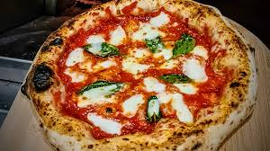
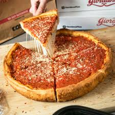

# computer-vision-pizza-classifcation

**Description:**

This repository contains a prototype that uses a combination of computer vision and natural language processing to classify pizzas. It leverages several powerful tools, including **LangChain**, **LlamaIndex**, **LLaVA**, and **OpenAI**. The goal is to demonstrate how these technologies can work together for pertinent pizza classification purposes.

**Key Technologies Used:**
*   **LangChain**: A framework for developing applications powered by language models.
*   **LlamaIndex**: A data framework for building applications with LLMs
*   **LLaVA**: A large multimodal model that combines vision and language.
*  **OpenAI**: Provides access to powerful language models that can be used in the pipeline.

**Purpose**
This prototype aims to showcase how computer vision and natural language can be used together for specific tasks, in this case, pizza classification. The combination of these methods is intended to provide more accurate and detailed analysis.

**Repository Details:**
*   **LLava:** This code leverages open-source LLaVa, LangChain, and LLamaIndex software to "train" a model with text prompt engineering and successfully validate it's effectiveness with photos.
*   **Roboflow** This leverages the Roboflow workflow and deployment, where I was able to easily retrain a model using photos of Deepdish and Neapolitan pizza that I selected and manually labeled, and then validated on the validation images.

**How to Use This Repository:**
Understanding the difference between Napoletana and Deepdish is imperative for several reasons, which can extend into cultural, culinary, and even metaphorical contexts:
Culinary Appreciation:
        Napoletana Pizza: Originating from Naples, Italy, this pizza is characterized by its thin, soft, and chewy crust with a high rim (cornicione) that holds in the toppings. It's traditionally cooked in a wood-fired oven which gives it a unique charred, smoky flavor. The simplicity and quality of ingredients like San Marzano tomatoes, buffalo mozzarella, basil, and a bit of olive oil are paramount.
        Deepdish Pizza: Hailing from Chicago, this style is known for its thick, buttery crust that forms a deep "dish" to hold copious amounts of cheese, toppings, and sauce (which is often added on top rather than the bottom). It's more of a casserole than the flat, open-faced Neapolitan style.

## To quickly get started:

    1. Setup an environment
        python3 -m venv cv_pizza_env
        source cv_pizza_env/bin/activate

    2. Install packages
        python3 -m pip install -r requirements.txt

    3. Apply to local environment 
        python3 -m ipykernel install --name cv_pizza_env
        python3 -m ipykernel install --user
        
In essence, understanding these pizza styles is more than just about food; it's about appreciating diversity, history, and the joy of culinary exploration, which can be paralleled to the appreciation of diversity in coding practices and software solutions. See below for key.

#### Napoletana
 

#### Deepdish

